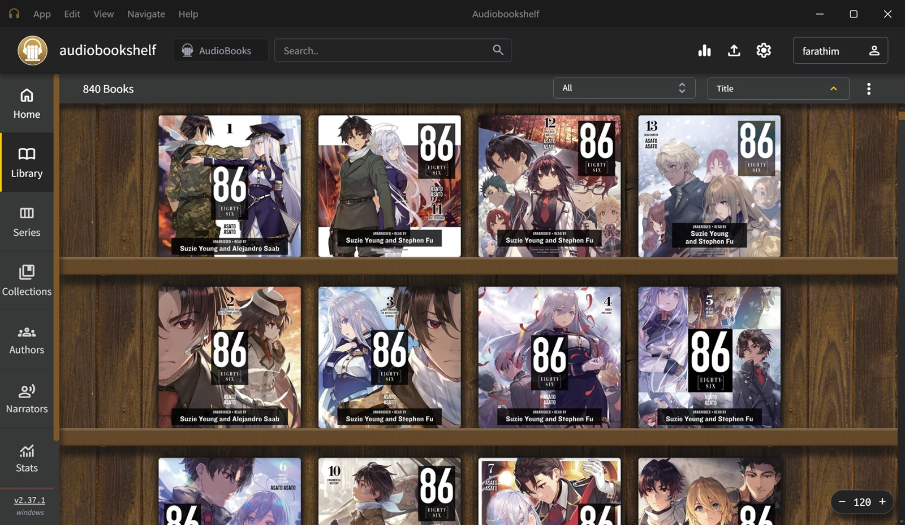

# ABS-DA — ABS Desktop App

An **unofficial Windows desktop app for [Audiobookshelf](https://www.audiobookshelf.org/)**.

It runs your server's **official Audiobookshelf web app** — player, e-book reader and every
admin tool (users, libraries, scanning, metadata editing, uploads, backups, logs, stats…) — in
a proper Windows app, with desktop extras on top: system tray, themes, bookshelf art, saved
login, media keys and more.



> ABS-DA is a community project. It is **not affiliated with or endorsed by** the Audiobookshelf
> project. All the credit for Audiobookshelf itself goes to [advplyr](https://github.com/advplyr)
> and the [Audiobookshelf contributors](https://github.com/advplyr/audiobookshelf).
> Please report ABS-DA problems here, not to the Audiobookshelf issue tracker.

## Download

Get the latest version from the **[Releases](https://github.com/Farathim89/abs-da/releases)** page:

| File | What it is |
|------|------------|
| `ABS-DA-Setup-<version>.exe` | Installer: Start Menu + desktop shortcuts, uninstaller, no admin rights needed |
| `ABS-DA-Portable-<version>.exe` | Single file, no install — settings are kept in an `abs-da-data` folder next to it |

Windows may show **"Windows protected your PC"** the first time, because the app isn't
code-signed. Click **More info → Run anyway**.

Start it, enter your server address (for example `http://192.168.1.10:13378` or
`https://abs.example.com`) and sign in. Works on your home network and remotely (domain,
dynamic DNS, reverse proxy, VPN).

Requires an Audiobookshelf server (tested with v2.36 and v2.37) and Windows 10 or 11 (64-bit).

## Features

**Everything from the official web app**: audiobooks, podcasts, e-books (EPUB, PDF, CBZ/CBR…),
collections, playlists, series, stats, and — for admin accounts — all the server settings.

**Desktop extras**

- Custom title bar with App · Edit · View · Navigate · Help menus, coloured to match the theme
- Remembers your server, window size and position; the login page shows which server you're on
- **Remember me** on the login page: your login is saved encrypted with Windows (DPAPI) and you're
  signed back in automatically. **App → Forget Saved Login** removes it.
- **Keeps playing in the system tray** when you close the window. Right-click the tray icon for
  what's playing, Play/Pause, skip back/forward, previous/next chapter and a **sleep timer**
- **Start with Windows** (in the tray)
- Keyboard **media keys** and the **Windows media controls** show the book and cover
- **6 themes** (Audiobookshelf, Midnight, OLED Black, Forest, Mocha, Amethyst) plus *Windows contrast
  colours* — they recolour the whole app, live
- **17 bookshelf arts**: woods, stone, materials and scenes (starry night, aurora, ocean), all
  drawn in code
- Mouse back/forward buttons, `Alt+←` / `Alt+→`, `F5` reload, `F11` fullscreen, zoom
- Links to other websites open in your normal browser
- Single sign-on (OpenID: Authentik, Keycloak, Authelia…) — the login provider's page opens
  inside the app and brings you back signed in
- Friendly "can't reach your server" screen, and a check that the address really is Audiobookshelf
- Only one copy runs at a time
- Works with Windows contrast themes without breaking sliders or the e-book reader colours
- Works around Audiobookshelf bug [#4818](https://github.com/advplyr/audiobookshelf/issues/4818)
  (volume slider opening behind the e-book reader)

## Privacy

ABS-DA talks only to the server you enter. No analytics, no telemetry, no accounts. Settings live
in `%APPDATA%\ABS Desktop App` (or `abs-da-data` next to the portable exe).

## Build from source

Needs [Node.js](https://nodejs.org) (LTS).

```bash
npm install
npm start
```

Build the installer and portable exe into `dist\`:

```bash
npm run dist
```

If the build fails with *"Cannot create symbolic link: A required privilege is not held"*,
run `build.cmd` as administrator once (it caches the signing toolkit); after that normal builds work.

### Source files

- `main.js` — window, title bar menus, themes, tray, shortcuts, navigation, settings
- `preload.js` — desktop bridge for the connect screen, Remember me, mouse side buttons
- `server.js` — checks a server address and finds its web app
- `shelf-art.js` — the procedural bookshelf textures (SVG) and their plank colours
- `titlebar.*` — the custom title bar (the web app runs in a panel underneath it)
- `connect.*` — the connect / change server / can't-reach screen
- `build/installer.nsh` — removes the Start with Windows entry on uninstall

## Contributing

Bug reports, ideas and pull requests are welcome — [open an issue](https://github.com/Farathim89/abs-da/issues/new/choose)
(or use **Help → Report a Problem** in the app).

## License

ABS-DA is free software: you can redistribute it and/or modify it under the terms of the
**GNU General Public License v3.0 or later** — see [LICENSE](LICENSE). The same licence as
Audiobookshelf itself.

Copyright © 2026 Farathim
